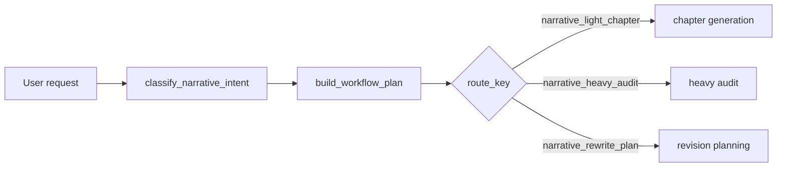
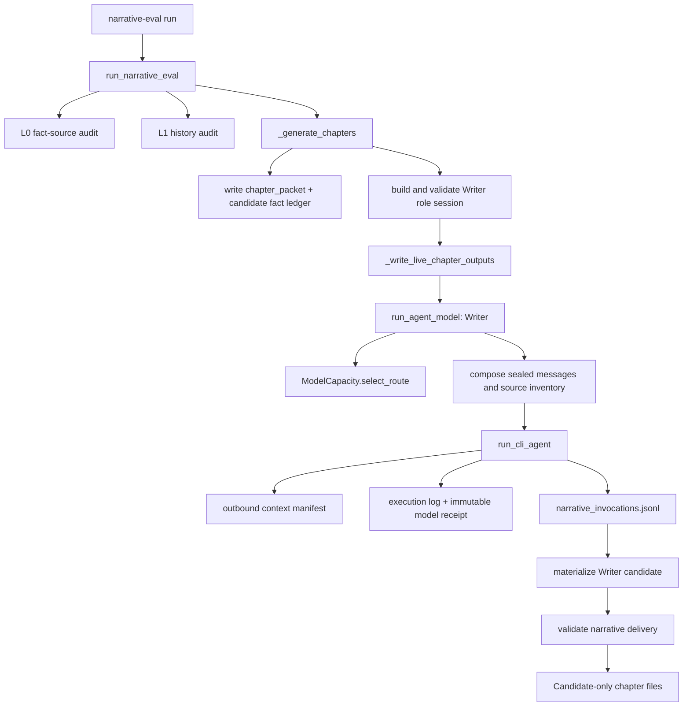
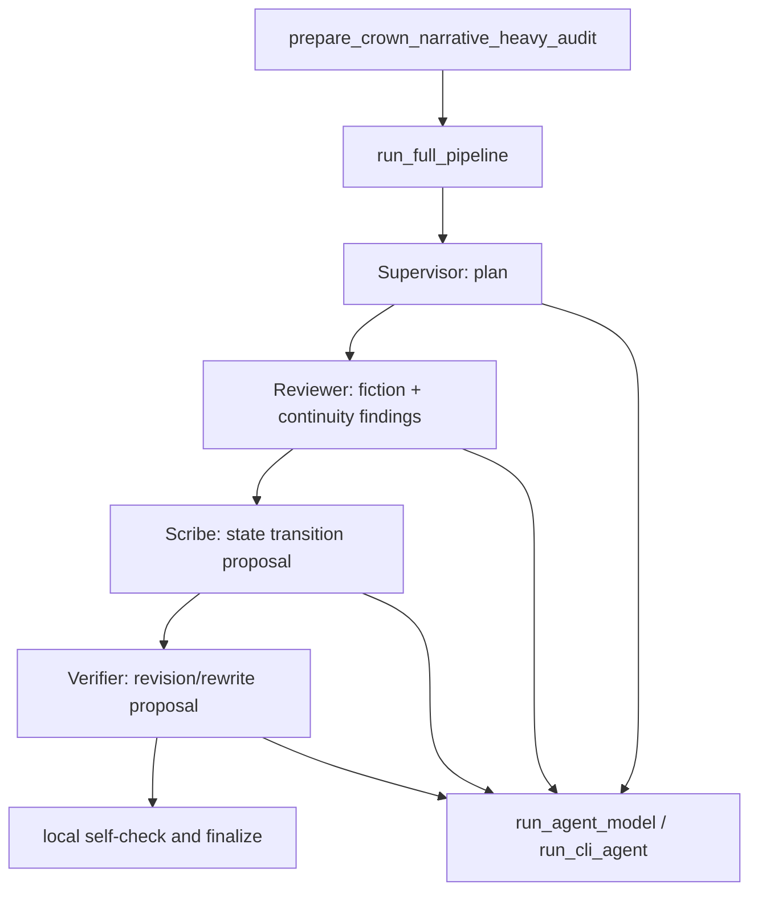
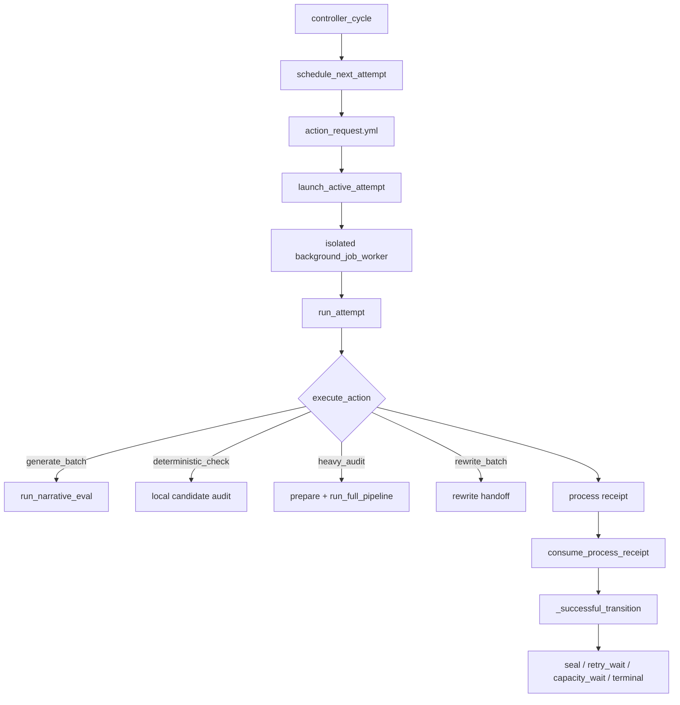

# AgentLab narrative call graph (Phase 0)

Status: diagnostic baseline, 2026-07-19. This document describes the code and
artifacts at commit `8456bc6ad487d68c7404e6c14ef2a82ad2fe9706`; it does not
claim that the 200-chapter workflow is stable.

## Product boundary

AgentLab currently acts as the project governor around a Writer model: it builds
bounded context, selects a provider route, records lineage, validates candidate
artifacts, and schedules audit/recovery. The external model writes prose. This
separation is the correct architectural boundary; the defects are in identity,
quality gates, measurement, and the cost of governance around that boundary.

## Entry and routing

The public classifier in `agent_runtime/narrative_intent.py` gives rewrite
signals precedence over audit signals. A complete audit-only request that says
the audit may emit `revision_or_rewrite_proposal.yml` therefore produces
`kind=rewrite`, reason `blocking_audit_rewrite_with_narrative_scope`. This is a
confirmed entry-boundary identity defect.

The inspected Crown background controller does not reclassify its persisted
`action_request.yml`: it carries a structured `action` such as `heavy_audit` to
the worker. However, it has no general `job_kind`/`run_mode` contract and remains
Crown-specific. The safe conclusion is therefore:

- the public narrative request compiler is demonstrably ambiguous;
- the current Crown attempt handoff is action-based, not a second natural-language
  classification;
- a future generic queue cannot safely use the classifier result as durable job
  identity without the proposed structured fields.

## Light chapter generation

The Phase 0 telemetry hook is intentionally between provider return and patch or
artifact materialization. It therefore preserves a paid/attempted call even if
schema parsing, candidate materialization, or a later retry fails. It is enabled
only when `AGENTLAB_NARRATIVE_DIAGNOSTICS=1` and the route starts with
`narrative_`.

For a normal Writer call, the sealed packet contains:

- runtime registry and Writer template/skill;
- user request, mission/workflow metadata, and chapter packet;
- project fact snapshot and artifact index;
- bible and outline authority files;
- previous chapter candidate and continuity state;
- retry feedback or candidate fact ledger when present.

The historical Ch01-Ch30 set is not one 30-chapter call. It contains 50 provider
processes across 30 chapter runs, with repeated Writer invocations inside some
runs.

## Heavy audit

Only Reviewer receives `narrative_audit_context.md`, which contains the bounded
chapter prose. Scribe and Verifier receive derived reports and contracts, not the
full manuscript. Supervisor receives governance/request material. The expensive
duplication is therefore not “four full-manuscript reads”; it is repeated generic
governance/context plus overlapping derived audit material.

Observed Ch21-Ch30 post-repair context and execution:

| Role | Packet bytes | Source files | Source bytes | Provider seconds | Pipeline-node seconds | Ledger input/output tokens | Known cost |
|---|---:|---:|---:|---:|---:|---:|---:|
| Supervisor | 145,023 | 15 | 142,562 | 312.610 | 316.345 | 34,624 / 5,422 (estimated) | unknown |
| Reviewer | 345,971 | 10 | 344,723 | 177.487 | 181.256 | 87,637 / 10,889 | $1.150950 |
| Scribe | 105,927 | 9 | 109,119 | 59.246 | 63.001 | 30,738 / 4,330 | $0.419385 |
| Verifier | 116,476 | 10 | 123,402 | 63.123 | 66.851 | 34,122 / 5,162 | $0.497500 |

Across those four manifests, source occurrences total 719,806 bytes. Counting
each SHA256 only once leaves 457,455 unique bytes; 262,351 bytes (36.45%) are
repeated across roles.

The generic `context_budget.yml` reports only 42 estimated input tokens for this
run, while the actual Reviewer packet is 345,971 bytes and its provider receipt
reports 87,637 input tokens. The generic context-budget stage is measuring a
repo-placeholder pack, not the final narrative role packet, and cannot currently
govern the real outbound context.

## Background execution and recovery

The controller has useful persistence primitives: action requests, isolated
worker processes, idempotency keys, atomic receipts, retry/capacity waits, and
orphan recovery. It is not yet a generic narrative queue:

- job creation is `create_crown_delivery_job`;
- the state schema lacks `job_kind`, `run_mode`, candidate-set identity, lease
  token, and audit lineage;
- `_heavy_audit` reads only `continuity_failure_report.yml` to derive
  `requires_rewrite`;
- `_successful_transition` seals when that boolean is false, without checking
  `fiction_review`, quality blocking, stale hashes, or independent re-audit.

The deterministic replay `fiction_review=blocked`, `continuity=pass` currently
ends with `status=batch_sealed` and one sealed batch.

## Facts and receipts

The current run directory contains multiple partially overlapping evidence
surfaces:

| Surface | What it can prove | Current limitation |
|---|---|---|
| `execution_log.yml` | provider process count and exact start/end | no tokens/cost and no durable cross-run identity |
| `model_execution_receipt_*.yml` | provider/model/session/usage/cost evidence | older role manifests can be overwritten; some models are unpriced |
| `cost_ledger.yml` | pipeline-accounted calls | historically omits paid calls after retry/materialization failure |
| `outbound_context_manifest_*.yml` | packet/source bytes and hashes | one current role manifest can replace retry history |
| `narrative_invocations.jsonl` | append-only per-attempt snapshot | Phase 0 opt-in; absent from historical runs |
| `project_artifact_index.yml` | project artifact lineage | not yet the sole workbench state source |

The new event log contains metadata and hashes only; it deliberately excludes
model output/prose and marks every Phase 0 event `candidate_only: true` and
`production_modified: false`.
